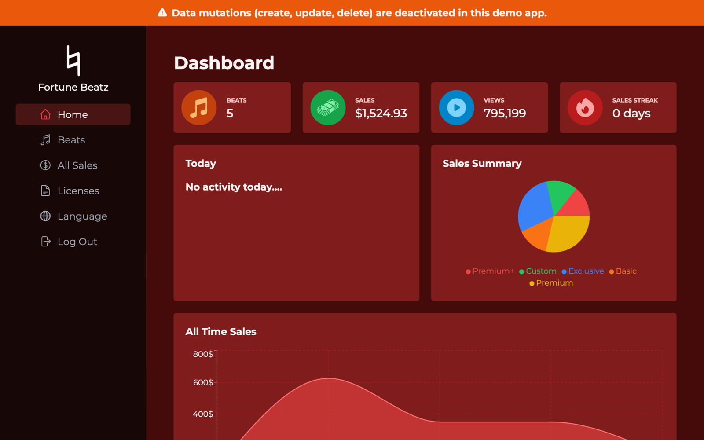
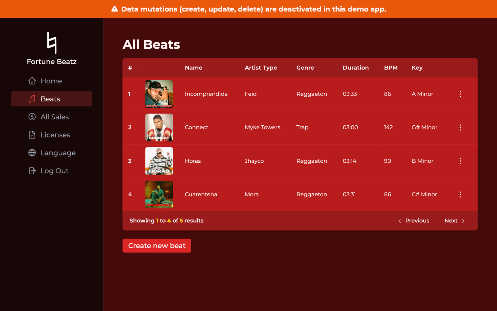
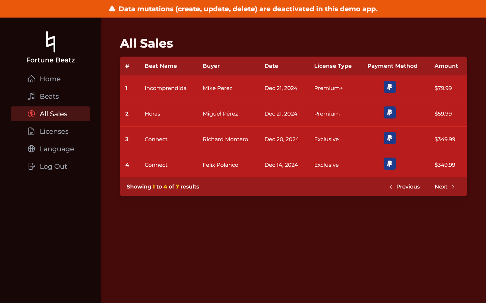
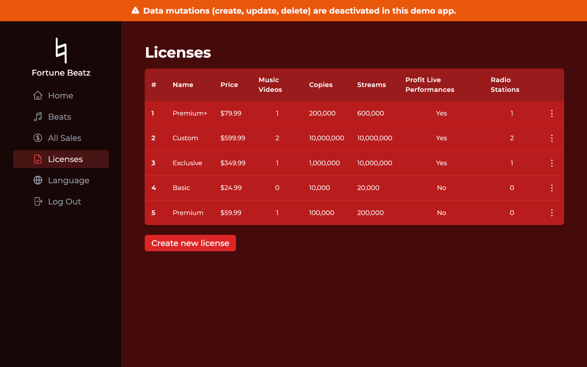
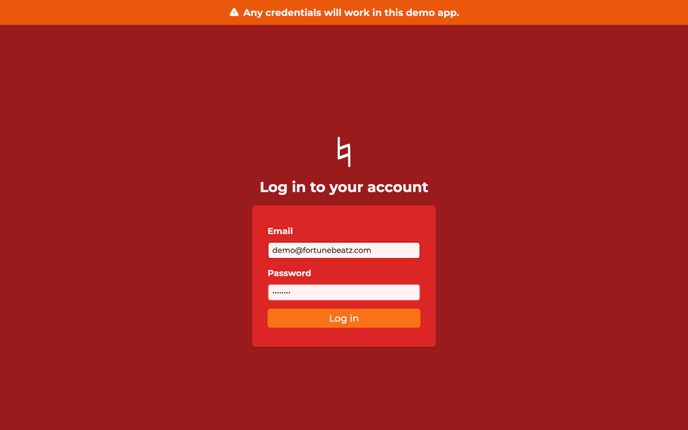
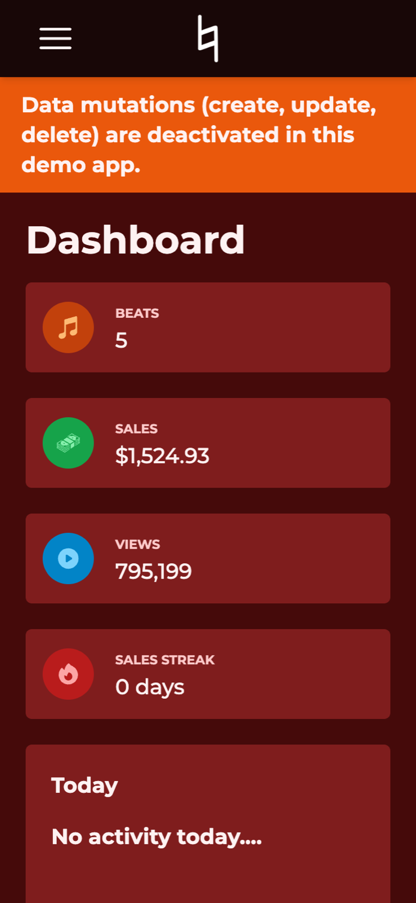

<div align="center">
  
  <h1>Fortune Beatz</h1>
  <p>Dashboard for music producers to manage beats, licenses and sales in one place.</p>

  <a href="https://fortune-beatz.vercel.app"><strong>Live demo →</strong></a>
  <br />
  <sub>Any email and password work on the demo. Create, update and delete are disabled.</sub>
</div>

<br />



## Features

- **Dashboard** — total beats, revenue, YouTube channel views and sales streak, plus today's activity, a sales-by-license pie chart and an all-time revenue chart
- **Beats catalog** — paginated table with cover art, BPM, key and genre, and a built-in audio player
- **Beat uploads** — cover art and audio stored in Supabase Storage; images compressed client-side, files can be picked straight from Google Drive
- **Licenses** — create and manage lease tiers (price, copies, streams, music videos, radio, live performance rights)
- **Sales** — history of every purchase with buyer, license type, payment method and amount
- **Auth** — email/password login and protected routes with Supabase Auth
- **i18n** — English and Spanish, auto-detected from the browser
- **Responsive** — full mobile layout with a collapsible sidebar

## Screenshots

| Beats | Sales |
| --- | --- |
|  |  |

| Licenses | Login |
| --- | --- |
|  |  |

<p align="center">
  
</p>

## Demo mode

The [live demo](https://fortune-beatz.vercel.app) runs the [`DemoVersion`](https://github.com/davidsantana1/fortune-beatz/tree/DemoVersion) branch, a read-only build of `main`:

- Login is simulated, so any email and password work
- Create, update and delete are disabled in the UI and blocked by Row Level Security in the database

`main` holds the full app with real authentication, CRUD and file uploads.

## Tech stack

| Area | Tools |
| --- | --- |
| UI | React 18, Vite 6, Tailwind CSS |
| Data | Supabase (Postgres, Auth, Storage, Row Level Security), TanStack Query |
| Routing & forms | React Router 7, React Hook Form |
| Charts & media | Recharts, react-h5-audio-player, Compressor.js |
| Integrations | YouTube Data API, Google Drive Picker |
| i18n | i18next, react-i18next |
| Deploy | Vercel |

## Getting started

Requires Node 18+ and pnpm.

```bash
git clone https://github.com/davidsantana1/fortune-beatz.git
cd fortune-beatz
pnpm install
cp .env.example .env   # fill in your keys
pnpm dev
```

### Environment variables

| Variable | Description |
| --- | --- |
| `VITE_SUPABASE` | Supabase anon (public) key |
| `VITE_YOUTUBE` | YouTube Data API key, used for channel view stats |
| `VITE_DRIVE` | Google API key for the Drive Picker |
| `VITE_DRIVE_CLIENT_ID` | Google OAuth client ID for Drive access |

All keys are client-side by design. Supabase tables are protected with Row Level Security, and the Google keys are restricted by HTTP referrer and API.

## Project structure

```
src/
├── features/     # domain modules: beats, sales, licenses, dashboard, auth, audio-player
├── services/     # Supabase and external API calls
├── context/      # auth and audio player state
├── pages/        # route-level components
├── ui/           # shared presentational components
└── utils/        # helpers, constants, i18n locales
```
